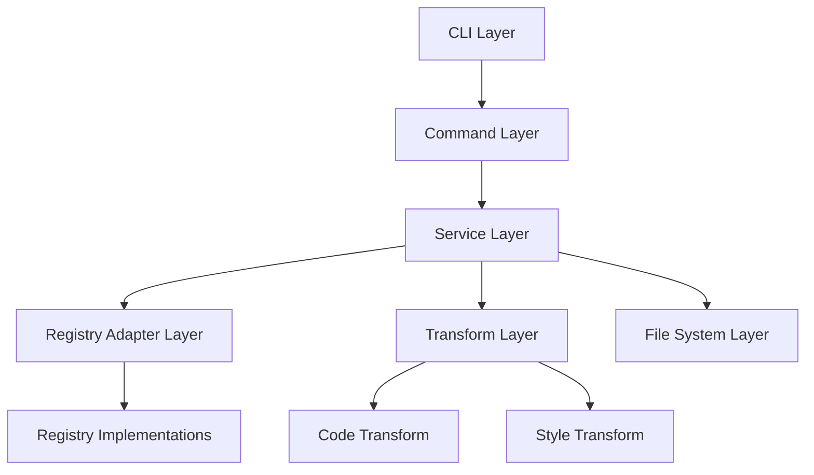
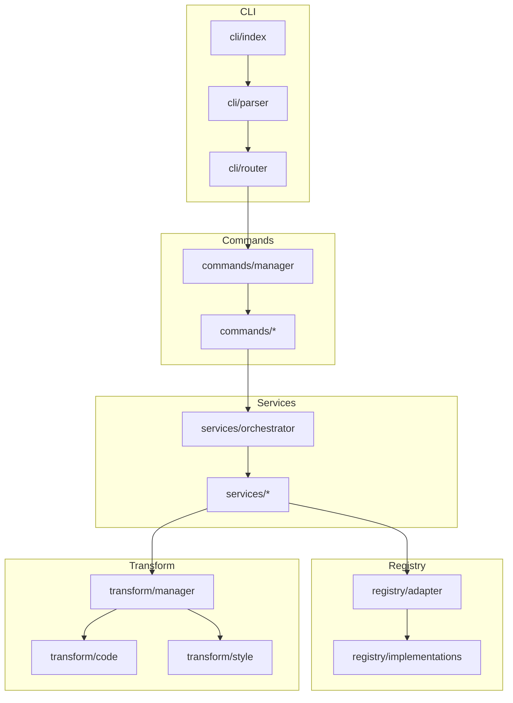
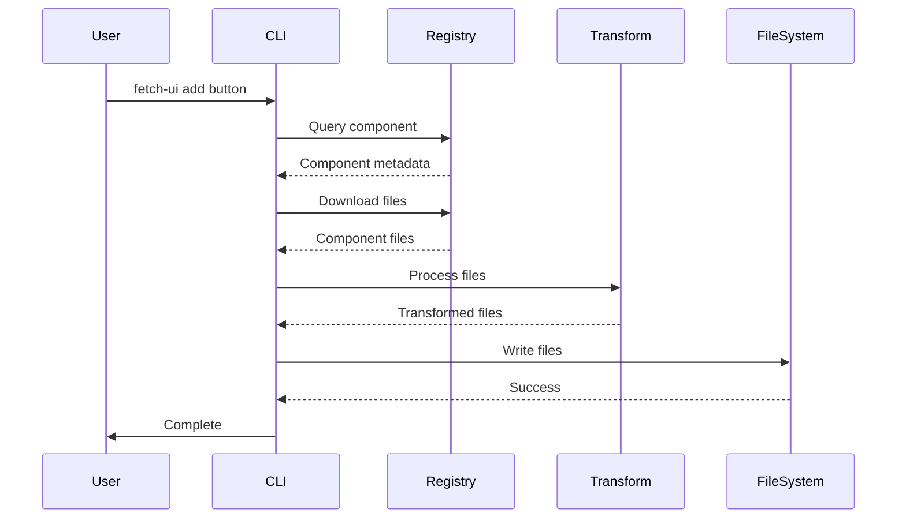
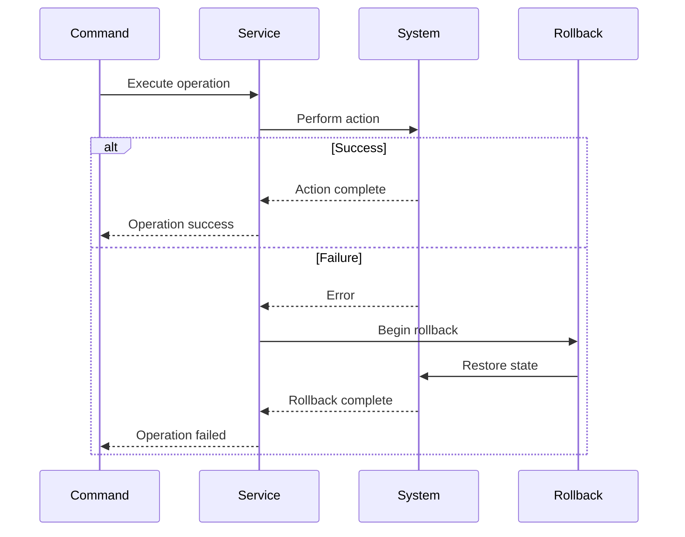
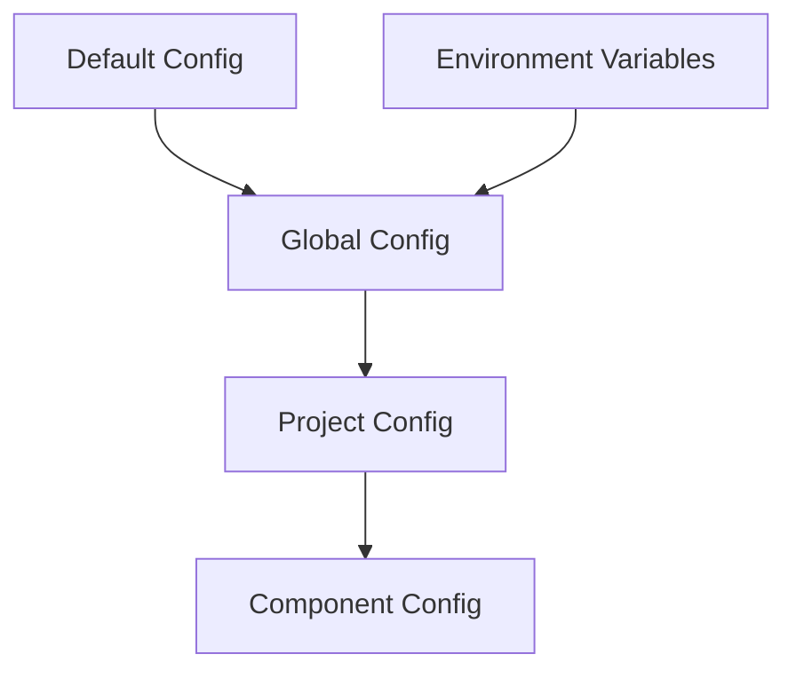

# Fetch UI CLI - Technical Design Document

## 1. System Architecture

### 1.1 Layer Design



#### CLI Layer
- Command line argument parsing
- Environment setup
- Command routing
- Exit code handling

#### Command Layer
- Command orchestration
- Progress reporting
- User interaction
- Command history

#### Service Layer
- Business logic
- Operation validation
- Error handling
- State management
- Operation atomicity

#### Registry Adapter Layer
- Registry protocol abstraction
- Registry type resolution
- Version compatibility
- Registry authentication

#### Transform Layer
- Transform orchestration
- Plugin management
- Transform validation
- Resource cleanup

#### File System Layer
- File operations
- Directory management
- Permission handling
- Atomic writes

### 1.2 Module Dependencies



## 2. Core Flows

### 2.1 Component Installation Flow



### 2.2 Error Recovery Flow



## 3. Interface Definitions

### 3.1 Core Interfaces

```typescript
// CLI Interface
interface CLIParser {
  parse(args: string[]): ParsedArgs;
  validate(args: ParsedArgs): ValidationResult;
  normalize(args: ParsedArgs): NormalizedArgs;
}

interface CLIRouter {
  route(args: NormalizedArgs): Promise<Command>;
  registerCommand(name: string, handler: CommandHandler): void;
  unregisterCommand(name: string): void;
}

// Command Interface
interface CommandManager {
  loadCommands(): Promise<void>;
  executeCommand(name: string, args: any[]): Promise<void>;
  validateCommand(name: string, args: any[]): Promise<boolean>;
}

interface Command {
  name: string;
  description: string;
  execute(args: any[]): Promise<void>;
  validate(args: any[]): Promise<boolean>;
  cleanup(): Promise<void>;
}
```

### 3.2 Service Layer

```typescript
// Service Orchestrator
interface ServiceOrchestrator {
  // Service coordination
  coordinate(operation: Operation): Promise<void>;
  validate(operation: Operation): Promise<boolean>;
  rollback(operation: Operation): Promise<void>;
  
  // Service registration
  register(service: Service): void;
  unregister(serviceName: string): void;
}

// Component Service
interface ComponentService {
  // Component operations
  resolveComponent(name: string): Promise<Component>;
  validateComponent(component: Component): Promise<boolean>;
  installComponent(component: Component): Promise<void>;
  
  // Dependency management
  resolveDependencies(component: Component): Promise<Dependency[]>;
  validateDependencies(deps: Dependency[]): Promise<boolean>;
  installDependencies(deps: Dependency[]): Promise<void>;
}

// Operation Context
interface OperationContext {
  id: string;
  type: OperationType;
  state: OperationState;
  resources: Resource[];
  metadata: Record<string, any>;
}
```

### 3.3 Registry Layer

```typescript
// Registry Adapter
interface RegistryAdapter {
  // Registry operations
  connect(config: RegistryConfig): Promise<void>;
  disconnect(): Promise<void>;
  health(): Promise<HealthStatus>;
  
  // Component operations
  getComponent(name: string): Promise<Component>;
  listComponents(): Promise<Component[]>;
  validateComponent(component: Component): Promise<boolean>;
  
  // Version management
  resolveVersion(name: string, version: string): Promise<string>;
  getVersions(name: string): Promise<Version[]>;
}

// Registry Implementation
interface RegistryImplementation {
  // Protocol specific
  protocol: RegistryProtocol;
  authenticate(): Promise<void>;
  handleRateLimit(): Promise<void>;
  
  // Data operations
  fetchMetadata(path: string): Promise<Metadata>;
  fetchContent(path: string): Promise<Content>;
  validateChecksum(content: Content): Promise<boolean>;
}
```

### 3.4 Transform Layer

```typescript
// Transform Manager
interface TransformManager {
  // Transform orchestration
  registerTransform(transform: Transform): void;
  unregisterTransform(name: string): void;
  getTransform(name: string): Transform;
  
  // Transform operations
  validate(input: TransformInput): Promise<boolean>;
  execute(input: TransformInput): Promise<TransformResult>;
  cleanup(result: TransformResult): Promise<void>;
}

// Code Transform
interface CodeTransform {
  // AST operations
  parse(content: string): AST;
  analyze(ast: AST): AnalysisResult;
  transform(ast: AST, rules: TransformRules): AST;
  generate(ast: AST): string;
  
  // Validation
  validateSyntax(content: string): Promise<boolean>;
  validateImports(ast: AST): Promise<boolean>;
  validateTypes(ast: AST): Promise<boolean>;
}

// Style Transform
interface StyleTransform {
  // Style operations
  parseStyles(content: string): StyleAST;
  transformStyles(ast: StyleAST, rules: StyleRules): StyleAST;
  generateStyles(ast: StyleAST): string;
  
  // Validation
  validateSelectors(ast: StyleAST): Promise<boolean>;
  validateProperties(ast: StyleAST): Promise<boolean>;
  validateCompatibility(ast: StyleAST): Promise<boolean>;
}
```

### 3.5 File System Layer

```typescript
interface FileSystemManager {
  // File operations
  read(path: string): Promise<Content>;
  write(path: string, content: Content): Promise<void>;
  delete(path: string): Promise<void>;
  
  // Directory operations
  createDirectory(path: string): Promise<void>;
  listDirectory(path: string): Promise<FileEntry[]>;
  
  // Security
  validatePath(path: string): boolean;
  checkPermissions(path: string): Promise<boolean>;
  
  // Atomic operations
  atomicWrite(path: string, content: Content): Promise<void>;
  atomicMove(source: string, target: string): Promise<void>;
}
```

## 4. Error Handling

### 4.1 Error Categories

```typescript
type ErrorCategory =
  | "UserError"      // Invalid input, wrong usage
  | "SystemError"    // File system, network issues
  | "RegistryError"  // Registry communication
  | "TransformError" // Code transformation
  | "ValidationError"; // Type checking, linting

interface ErrorHandler {
  category: ErrorCategory;
  severity: "warning" | "error" | "fatal";
  recoverable: boolean;
  handle(error: Error): Promise<void>;
  recover?(): Promise<void>;
}
```

### 4.2 Recovery Strategies

```typescript
interface RecoveryStrategy {
  // State management
  saveState(): Promise<void>;
  loadState(): Promise<void>;
  validateState(): Promise<boolean>;

  // Recovery actions
  rollbackChanges(): Promise<void>;
  cleanupResources(): Promise<void>;
  restoreBackup(): Promise<void>;
}
```

## 5. Performance Considerations

### 5.1 Resource Management

```typescript
interface ResourceManager {
  // Memory management
  allocateMemory(size: number): boolean;
  releaseMemory(handle: number): void;
  getMemoryUsage(): number;

  // File handles
  openFiles: Set<string>;
  maxOpenFiles: number;
  closeIdleFiles(): void;

  // Network connections
  connectionPool: ConnectionPool;
  maxConnections: number;
  idleTimeout: number;
}
```

### 5.2 Parallel Processing

```typescript
interface WorkerPool {
  // Worker management
  size: number;
  active: number;
  idle: number;

  // Task scheduling
  schedule(task: Task): Promise<void>;
  execute(tasks: Task[]): Promise<Result[]>;
  terminate(): Promise<void>;
}
```

## 6. Security Measures

### 6.1 Authentication

```typescript
interface Authentication {
  // Token management
  validateToken(token: string): Promise<boolean>;
  refreshToken(token: string): Promise<string>;
  revokeToken(token: string): Promise<void>;

  // Rate limiting
  checkRateLimit(key: string): boolean;
  updateRateLimit(key: string): void;
}
```

### 6.2 File System Security

```typescript
interface FileSystemSecurity {
  // Permission checks
  checkPermissions(path: string): Promise<boolean>;
  validatePath(path: string): boolean;
  sanitizePath(path: string): string;

  // Safe operations
  atomicWrite(path: string, content: string): Promise<void>;
  secureDelete(path: string): Promise<void>;
}
```

## 7. Monitoring and Telemetry

### 7.1 Metrics Collection

```typescript
interface Metrics {
  // Performance metrics
  commandDuration: Record<string, number>;
  transformTime: Record<string, number>;
  memoryUsage: number[];

  // Error metrics
  errorCount: Record<ErrorCategory, number>;
  errorRate: number;

  // Usage metrics
  commandUsage: Record<string, number>;
  registryRequests: number;
}
```

### 7.2 Logging

```typescript
interface Logger {
  // Log levels
  debug(message: string, context?: any): void;
  info(message: string, context?: any): void;
  warn(message: string, context?: any): void;
  error(message: string, error?: Error): void;

  // Log management
  rotate(): Promise<void>;
  clean(): Promise<void>;
}
```

## 8. Configuration Management

### 8.1 Configuration Hierarchy



### 8.2 Configuration Validation

```typescript
interface ConfigValidator {
  // Schema validation
  validateSchema(config: any): Promise<boolean>;
  validateConstraints(config: any): Promise<boolean>;

  // Dependency validation
  validateDependencies(config: any): Promise<boolean>;
  validateVersions(config: any): Promise<boolean>;
}
