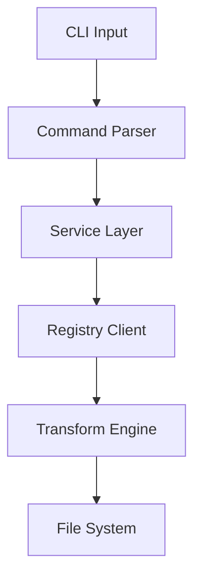

# Fetch UI CLI - Technical Design Document

## Use Cases

### 1. Component Installation
```bash
# Install a single component
npx fetch-ui add button --registry custom-registry.com

# Install multiple components with dependencies
npx fetch-ui add button card dialog --to src/components

# Interactive component selection
npx fetch-ui add
```

### 2. Project Initialization
```bash
# Initialize with defaults
npx fetch-ui init

# Initialize with custom configuration
npx fetch-ui init --typescript --jsx --registry custom-registry.com

# Initialize in specific directory
npx fetch-ui init --cwd ./my-project
```

### 3. Component Management
```bash
# List available components
npx fetch-ui list

# Update components
npx fetch-ui update button
npx fetch-ui update --all

# Check component versions
npx fetch-ui list --outdated
```

### 4. Registry Management
```bash
# Add custom registry
npx fetch-ui registry add my-registry https://custom-registry.com

# List registries
npx fetch-ui registry list

# Switch registry
npx fetch-ui registry use my-registry
```

## Command Implementation Mapping

### Command Structure
```typescript
interface CommandMapping {
  name: string;          // Command name
  implementation: string;// Implementation file
  options: Option[];     // Command options
  action: string;        // Action handler
}

interface Option {
  flag: string;         // Option flag
  description: string;  // Option description
  default?: any;        // Default value
  required?: boolean;   // Is required
}
```

### Command Implementations

#### 1. Add Command
```typescript
// Implementation: src/commands/add.ts
{
  name: 'add [components...]',
  implementation: 'commands/add.ts',
  options: [
    {
      flag: '--registry <url>',
      description: 'Registry URL',
      required: false
    },
    {
      flag: '--to <path>',
      description: 'Target directory',
      default: './components'
    },
    {
      flag: '--style <name>',
      description: 'Component style',
      default: 'default'
    }
  ],
  action: 'addCommand'
}
```

#### 2. Init Command
```typescript
// Implementation: src/commands/init.ts
{
  name: 'init',
  implementation: 'commands/init.ts',
  options: [
    {
      flag: '--typescript',
      description: 'Use TypeScript',
      default: true
    },
    {
      flag: '--jsx',
      description: 'Use JSX',
      default: true
    },
    {
      flag: '--cwd <path>',
      description: 'Working directory',
      default: '.'
    }
  ],
  action: 'initCommand'
}
```

#### 3. List Command
```typescript
// Implementation: src/commands/list.ts
{
  name: 'list',
  implementation: 'commands/list.ts',
  options: [
    {
      flag: '--json',
      description: 'Output as JSON',
      default: false
    },
    {
      flag: '--outdated',
      description: 'Show outdated components',
      default: false
    }
  ],
  action: 'listCommand'
}
```

#### 4. Update Command
```typescript
// Implementation: src/commands/update.ts
{
  name: 'update [component]',
  implementation: 'commands/update.ts',
  options: [
    {
      flag: '--all',
      description: 'Update all components',
      default: false
    },
    {
      flag: '--check',
      description: 'Check for updates only',
      default: false
    }
  ],
  action: 'updateCommand'
}
```

#### 5. Registry Command
```typescript
// Implementation: src/commands/registry.ts
{
  name: 'registry <action>',
  implementation: 'commands/registry.ts',
  options: [
    {
      flag: '--name <name>',
      description: 'Registry name',
      required: true
    },
    {
      flag: '--url <url>',
      description: 'Registry URL',
      required: true
    }
  ],
  action: 'registryCommand'
}
```

## Technical Architecture

### 1. Core Layers

#### 1.1 Command Layer
- Command parsing and validation
- Option handling
- Interactive prompts
- Error handling

#### 1.2 Service Layer
- Component resolution
- Dependency management
- File operations
- Registry communication

#### 1.3 Transform Layer
- AST transformation
- Path resolution
- Import/Export handling
- Style processing

#### 1.4 Registry Layer
- Registry protocol
- Version resolution
- Authentication

### 2. Data Flow



### 3. Component Resolution Process

1. **Input Processing**
   - Parse command arguments
   - Validate component names
   - Resolve target paths

2. **Registry Resolution**
   - Query registry for component
   - Resolve dependencies
   - Download component files

3. **Transform Process**
   - Parse component files
   - Transform imports/exports
   - Process styles
   - Generate types

4. **Installation**
   - Write files
   - Update configuration
   - Install dependencies

### 4. Error Handling Strategy

#### 4.1 User Errors
- Invalid command usage
- Missing configuration
- Invalid component names
- Path resolution failures

#### 4.2 System Errors
- Network failures
- File system errors
- Transform failures
- Registry unavailability

#### 4.3 Recovery Process
- Automatic rollback
- Clean up temporary files
- Restore previous state
- Error reporting

### 5. Configuration Management

#### 5.1 Global Configuration
```typescript
interface GlobalConfig {
  defaultRegistry: string;
  authTokens: Record<string, string>;
  telemetry: boolean;
}
```

#### 5.2 Project Configuration
```typescript
interface ProjectConfig {
  registry: string;
  components: {
    path: string;
    prefix: string;
  };
  typescript: boolean;
  styling: {
    tailwind: boolean;
    cssModules: boolean;
  };
}
```

### 6. Security Considerations

#### 6.1 Registry Security
- HTTPS only connections
- Token-based authentication
- Rate limiting
- Checksum verification

#### 6.2 Code Security
- Source validation
- Dependency scanning
- Transform sandboxing
- Permission checks

### 7. Performance Optimization

#### 7.1 Parallel Processing
- Concurrent downloads
- Parallel transforms
- Batch file operations
- Worker pool management

#### 7.2 Resource Management
- Memory usage optimization
- File handle management
- Network connection pooling
- Process cleanup

### 8. Monitoring and Telemetry

#### 8.1 Metrics
- Command usage
- Error rates
- Performance metrics
- Registry health

#### 8.2 Logging
- Operation logs
- Error logs
- Audit logs
- Debug information
